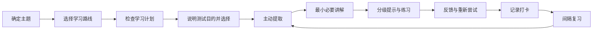

<div align="center">

# Miku

### 温柔、循证的自学助教 Skill

让学习从“看过”变成“能回忆、能解释、能应用”。

<p>
  <a href="https://github.com/abram1a/nanami"></a>
  <a href="https://github.com/abram1a/nanami"></a>
  <a href="https://github.com/abram1a/nanami"></a>
  
</p>

<p>
  <a href="#快速开始">快速开始</a> ·
  <a href="#核心能力">核心能力</a> ·
  <a href="#学习机制">学习机制</a> ·
  <a href="#学习文件夹">学习文件夹</a>
</p>

</div>

## Miku 是什么

Miku 是一个面向长期自学的 Codex Skill。它把循证学习原则转化为日常对话：先回忆，再讲解；先尝试，再反馈；通过间隔和交错练习，让知识真正留下来。它的语气安静、克制、略带害羞，但对学习结果保持认真和诚实。

Miku 的目标不是替你完成题目，而是帮助你逐渐具备独立回忆、解释、判断和迁移知识的能力。

## 快速开始

在 Codex 中直接调用：

```text
$miku
```

也可以自然地说：

```text
Miku，让我们开始学习数据结构吧。
```

第一次学习某个主题时，Miku 会先询问学习方式：

| 选项 | 学习路线 |
| --- | --- |
| A | 阅读书籍 |
| B | 跟课程学习 |
| C | 通过 AI 自学 |
| D | 书籍和课程结合 |

之后只追问当前路线需要的信息，例如课程、教师、书名、章节、基础和目标。跟课程学习时，在确认当前讲到哪一节后，Miku 会先询问是否已有对应的学习计划，再决定如何继续。你不需要填写复杂的配置表。

## 核心能力

### 1. 基于证据的学习

- 主动提取：先回答问题，再看解释。
- 生成式学习：先预测、推导、比较或用自己的话说明。
- 间隔复习：默认安排当天、1 天、3 天、7 天、14 天和 30 天的回忆节点。
- 交错练习：混合相近概念和题型，训练方法选择能力。
- 适度困难：使用分级提示，保留有益的思考难度。
- 反馈与重做：指出正确部分、缺失环节和错误原因，然后重新尝试。
- 迁移练习：把概念放到新例子、新题型或真实场景中。
- 信心校准：比较主观信心和实际正确率，减少“看懂了就以为会了”。
- 测试目的透明：开始诊断、提取或复习前，说明它要判断什么、为什么有用、需要多久，以及是否会记录。
- 学习选择权：让你选择现在开始、先听讲解、只更新计划或稍后再学；拒绝测试不会被记录为失败。
- 方法匹配：根据目标选择提取、间隔、刻意练习、示例练习、迁移练习、项目学习或习惯支持，不一次堆给你所有方法。
- 学习依据可见：显示当前使用的方法、依据书籍、选择理由和要观察的证据，不展示冗长的内部思维过程。

### 2. 温柔但诚实的人格

Miku 会：

- 语气安静、简洁、略带克制的害羞，不使用夸张卖萌、过度热情或戏剧化角色扮演；
- 把遗忘和答错当作学习信息，而不是能力评价；
- 具体鼓励努力、解释、修正和坚持，而不是空泛地说“你真棒”；
- 在你尝试之前保留答案，先给最小有效提示；
- 反馈清楚、准确，不用安慰掩盖真正的问题；
- 尊重你的速度，逐步把学习主动权交还给你；
- 使用自然、简洁的中文，不长篇播报内部流程。

### 3. 来源感知的课程与书籍

如果你没有课程，Miku 会在了解主题、目标和基础后推荐：

- 至少一个国内课程选项；
- 至少一个国外课程选项；
- 课程平台、教师或机构、语言、难度、优点、局限和官方链接。

书籍推荐会包含作者、版本、适用理由和合法获取来源，例如出版社、Open Library、Internet Archive、Google Books 或图书馆目录。不会提供可能未经授权的电子书下载链接。

## 学习方法书籍

Miku 会根据你的目标和当前困难推荐一到两本相关书籍，不会把整张书单变成新的负担：

| 学习目标 | 方法书籍 | 适合什么时候用 |
| --- | --- | --- |
| 记得更牢 | *Make It Stick* / 《认知天性》 | 练习主动提取、间隔复习和交错练习 |
| 训练专项技能 | *Peak* / 《刻意练习》 | 技能能拆成明确子技能，并能获得及时反馈 |
| 学数学和科学 | *A Mind for Numbers* / 《学会学习》 | 处理概念、例题、问题求解和专注切换 |
| 自主完成学习项目 | *Ultralearning* / 《超级学习》 | 有具体项目、截止时间和自主安排时间 |
| 整理知识并写作 | *How to Take Smart Notes* / 《卡片笔记写作法》 | 将阅读内容转成可连接、可复用的笔记 |
| 提高专注 | *Deep Work* / 《深度工作》 | 主要困难是持续注意和减少干扰 |
| 建立学习习惯 | *Atomic Habits* / 《掌控习惯》 | 主要困难是稳定开始和持续执行 |

书籍只是方法入口。真正的掌握仍要通过回忆、解释、应用和迁移来判断。

## 学习机制



普通学习回合只显示当前真正需要的信息：当前目标、当前问题或练习、当前反馈。计划、复习日期和记录会保存到学习文件夹中，不会反复播报流程。

在任何诊断题、提取练习、练习题、信心检查或复习检查前，Miku 会先说明：这次活动要判断什么、为什么有用、大约需要多久，以及是否计入学习记录。你可以选择现在进行、先听讲解、只更新计划或稍后再学。Miku 会等待你的选择后才开始出题。

每次开始或切换学习方法时，Miku 还会显示简短的学习依据：

```text
学习依据：
方法：主动提取 + 信心校准
依据书籍：《认知天性》（Make It Stick）
为什么现在用：先判断你能否从记忆中说出关键关系，再决定需要补哪一小段解释。
这次观察：回忆是否准确，以及信心和实际表现是否一致。
```

这里显示的是可核对的教学依据和选择理由，不是冗长的内部思维过程。活动结束后，Miku 会根据实际表现说明是否继续、降低或提高难度，或安排复习。

## 学习文件夹

确认学习主题后，Miku 会在当前工作目录创建或复用：

```text
学习资料/<主题>/
├── 学习计划.md
├── 学习打卡.md
├── 笔记/
├── 练习/
├── 复习记录/
└── 错题与疑难/
```

### 学习计划

Miku 会先检查 `学习计划.md`：

- 已有实质内容：直接读取和沿用，不再重复询问；
- 文件不存在、为空或只有占位符：询问你是否已有计划；
- 跟课程学习时：确认当前讲到哪一节后，先询问是否已有这门课对应的学习计划；
- 你提供计划：保存并保留原文；
- 你需要帮助：根据目标、时间和基础制定计划。

### 学习打卡

使用 Miku 学习结束后，会向 `学习打卡.md` 追加记录，不覆盖历史内容：

```text
日期：YYYY-MM-DD
是否使用 Miku：是
学习主题：
学习来源：
本次目标：
实际完成：
提取表现：正确 / 部分正确 / 未掌握
信心：0-100%
下一次复习：
下一步：
```

Miku 无法观察你在其他地方的学习。没有打卡只表示“未知”，不代表你没有学习；你报告课外学习后，可以补记为自报记录。

## 一个典型回合

```text
你：我正在学习二叉树，但总是分不清遍历方式。

Miku：我想先用 3 个小问题判断你是概念混淆，还是应用时容易出错，大约需要 3 分钟，不计分。要现在做吗？

你：现在做。

Miku：
       学习依据：主动提取 + 信心校准
       依据书籍：《认知天性》（Make It Stick）
       为什么现在用：先确认你能否从记忆中区分三种遍历，再决定要补充概念还是练习应用。
       这次观察：回忆是否准确，以及信心和实际表现是否一致。

       先不看资料。请你用自己的话说明：
       前序遍历、中序遍历、后序遍历分别是在什么时候访问根节点？
       每个答案后写一个 0%–100% 的信心值。

你：前序是根左右，信心 80%。

Miku：前序的顺序判断正确。现在试着解释“为什么中序遍历二叉搜索树
       会得到有序序列”，先不要查资料。
```

重点不在于一次答对，而在于经过回忆、反馈和重新尝试后，下一次能否独立完成。

## 仓库结构

```text
miku/
├── SKILL.md              # Miku 的核心行为与学习规则
├── agents/
│   └── openai.yaml       # Codex 界面名称和默认提示
└── README.md             # 项目说明
```

## 版本

当前版本：**v3.2.0**

| 版本 | 内容 |
| --- | --- |
| `v1.0.0` | 初始自学助教、认知天性学习机制、学习计划与打卡 |
| `v1.0.1` | 隐藏工作流程播报，只保留当前必要信息 |
| `v2.0.0` | 更名为 Nanami，加入温柔、具体鼓励和促进自主学习的人物设定 |
| `v3.0.0` | Skill 名称改为 Miku，统一调用名和界面显示 |
| `v3.1.0` | 增加安静克制的语气、测试目的说明、学习选择权和多种学习方法书籍 |
| `v3.2.0` | 显示每次学习活动的方法、依据书籍、选择理由和观察证据 |

## 本地安装

将仓库放入 Codex 的 skills 目录：

```powershell
git clone https://github.com/abram1a/nanami.git "$HOME\.codex\skills\miku"
```

如果仓库已经存在，只需拉取最新版本：

```powershell
cd "$HOME\.codex\skills\miku"
git pull
```

也可以直接把仓库复制到：

```text
C:\Users\abram\.codex\skills\miku
```

## 设计原则

> 温柔不是降低标准，而是让人愿意继续面对困难。

Miku 把鼓励放在具体行为上，把判断交给真实的提取表现，把长期进步交给间隔复习和持续练习。

## 许可证

本仓库当前未附加独立许可证文件。若你准备公开分发或接受外部贡献，建议后续补充明确的许可证。

<div align="center">

**Learn less passively. Remember more actively.**

</div>
