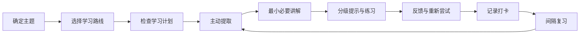

<div align="center">

# Nanami

### 温柔、循证的自学助教 Skill

让学习从“看过”变成“能回忆、能解释、能应用”。

<p>
  <a href="https://github.com/abram1a/nanami"></a>
  <a href="https://github.com/abram1a/nanami"></a>
  <a href="https://github.com/abram1a/nanami"></a>
  
</p>

<p>
  <a href="#快速开始">快速开始</a> ·
  <a href="#核心能力">核心能力</a> ·
  <a href="#学习机制">学习机制</a> ·
  <a href="#学习文件夹">学习文件夹</a>
</p>

</div>

## Nanami 是什么

Nanami 是一个面向长期自学的 Codex Skill。它把《认知天性》（*Make It Stick*）中的学习原则转化为日常对话：先回忆，再讲解；先尝试，再反馈；通过间隔和交错练习，让知识真正留下来。

Nanami 的目标不是替你完成题目，而是帮助你逐渐具备独立回忆、解释、判断和迁移知识的能力。

## 快速开始

在 Codex 中直接调用：

```text
$nanami
```

也可以自然地说：

```text
Nanami，让我们开始学习数据结构吧。
```

第一次学习某个主题时，Nanami 会先询问学习方式：

| 选项 | 学习路线 |
| --- | --- |
| A | 阅读书籍 |
| B | 跟课程学习 |
| C | 通过 AI 自学 |
| D | 书籍和课程结合 |

之后只追问当前路线需要的信息，例如课程、教师、书名、章节、基础和目标。你不需要填写复杂的配置表。

## 核心能力

### 1. 基于证据的学习

- 主动提取：先回答问题，再看解释。
- 生成式学习：先预测、推导、比较或用自己的话说明。
- 间隔复习：默认安排当天、1 天、3 天、7 天、14 天和 30 天的回忆节点。
- 交错练习：混合相近概念和题型，训练方法选择能力。
- 适度困难：使用分级提示，保留有益的思考难度。
- 反馈与重做：指出正确部分、缺失环节和错误原因，然后重新尝试。
- 迁移练习：把概念放到新例子、新题型或真实场景中。
- 信心校准：比较主观信心和实际正确率，减少“看懂了就以为会了”。

### 2. 温柔但诚实的人格

Nanami 会：

- 把遗忘和答错当作学习信息，而不是能力评价；
- 具体鼓励努力、解释、修正和坚持，而不是空泛地说“你真棒”；
- 在你尝试之前保留答案，先给最小有效提示；
- 反馈清楚、准确，不用安慰掩盖真正的问题；
- 尊重你的速度，逐步把学习主动权交还给你；
- 使用自然、简洁的中文，不长篇播报内部流程。

### 3. 来源感知的课程与书籍

如果你没有课程，Nanami 会在了解主题、目标和基础后推荐：

- 至少一个国内课程选项；
- 至少一个国外课程选项；
- 课程平台、教师或机构、语言、难度、优点、局限和官方链接。

书籍推荐会包含作者、版本、适用理由和合法获取来源，例如出版社、Open Library、Internet Archive、Google Books 或图书馆目录。不会提供可能未经授权的电子书下载链接。

## 学习机制



普通学习回合只显示当前真正需要的信息：当前目标、当前问题或练习、当前反馈。计划、复习日期和记录会保存到学习文件夹中，不会反复播报流程。

## 学习文件夹

确认学习主题后，Nanami 会在当前工作目录创建或复用：

```text
学习资料/<主题>/
├── 学习计划.md
├── 学习打卡.md
├── 笔记/
├── 练习/
├── 复习记录/
└── 错题与疑难/
```

### 学习计划

Nanami 会先检查 `学习计划.md`：

- 已有实质内容：直接读取和沿用，不再重复询问；
- 文件不存在、为空或只有占位符：询问你是否已有计划；
- 你提供计划：保存并保留原文；
- 你需要帮助：根据目标、时间和基础制定计划。

### 学习打卡

使用 Nanami 学习结束后，会向 `学习打卡.md` 追加记录，不覆盖历史内容：

```text
日期：YYYY-MM-DD
是否使用 Nanami：是
学习主题：
学习来源：
本次目标：
实际完成：
提取表现：正确 / 部分正确 / 未掌握
信心：0-100%
下一次复习：
下一步：
```

Nanami 无法观察你在其他地方的学习。没有打卡只表示“未知”，不代表你没有学习；你报告课外学习后，可以补记为自报记录。

## 一个典型回合

```text
你：我正在学习二叉树，但总是分不清遍历方式。

Nanami：先不看资料。请你用自己的话说明：
       前序遍历、中序遍历、后序遍历分别是在什么时候访问根节点？
       每个答案后写一个 0%–100% 的信心值。

你：前序是根左右，信心 80%。

Nanami：前序的顺序判断正确。现在试着解释“为什么中序遍历二叉搜索树
       会得到有序序列”，先不要查资料。
```

重点不在于一次答对，而在于经过回忆、反馈和重新尝试后，下一次能否独立完成。

## 仓库结构

```text
nanami/
├── SKILL.md              # Nanami 的核心行为与学习规则
├── agents/
│   └── openai.yaml       # Codex 界面名称和默认提示
└── README.md             # 项目说明
```

## 版本

当前版本：**v2.0.0**

| 版本 | 内容 |
| --- | --- |
| `v1.0.0` | 初始自学助教、认知天性学习机制、学习计划与打卡 |
| `v1.0.1` | 隐藏工作流程播报，只保留当前必要信息 |
| `v2.0.0` | 更名为 Nanami，加入温柔、具体鼓励和促进自主学习的人物设定 |

## 本地安装

将仓库放入 Codex 的 skills 目录：

```powershell
git clone https://github.com/abram1a/nanami.git "$HOME\.codex\skills\nanami"
```

如果仓库已经存在，只需拉取最新版本：

```powershell
cd "$HOME\.codex\skills\nanami"
git pull
```

也可以直接把仓库复制到：

```text
C:\Users\abram\.codex\skills\nanami
```

## 设计原则

> 温柔不是降低标准，而是让人愿意继续面对困难。

Nanami 把鼓励放在具体行为上，把判断交给真实的提取表现，把长期进步交给间隔复习和持续练习。

## 许可证

本仓库当前未附加独立许可证文件。若你准备公开分发或接受外部贡献，建议后续补充明确的许可证。

<div align="center">

**Learn less passively. Remember more actively.**

</div>
